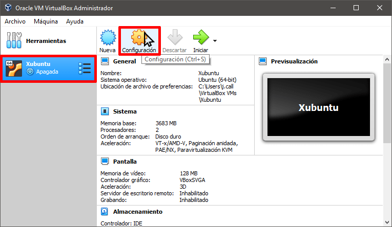

# Compartir carpetas

Seleccionaremos la máquina virtual en la que queremos compartir carpetas y archivos y presionaremos el botón de Configuración.



A continuación, en el panel de la izquierda clicaremos en la opción Carpetas Compartidas. Acto seguido en el panel de la derecha presionaremos el botón de Agregar nueva carpeta compartida.

 (1).png>)

#### Definir las opciones de montaje de las carpetas compartidas

Cuando se abra la ventana Agregar carpeta compartida definiremos los siguientes parámetros:

**Ruta carpeta:** Introducimos la ruta de la carpeta que queremos montar en la máquina virtual. Anteriormente, definimos que la carpeta que quiero montar es la **C:\movies**.

**Nombre carpeta:** Escribir un nombre cualquiera que servirá para identificar en todo momento la carpeta que estamos compartiendo. En mi caso he elegido **movies**.

**Sólo lectura:** En mi caso no tildo esta opción. De esta forma, cuando acceda a la carpeta compartida dentro de la máquina virtual dispondré de la totalidad de permisos. En caso de que tildará esta opción solo dispondría de permisos de lectura.

**Automontar:** Recomiendo tildar esta opción. De esta manera la carpeta compartida se automontará cada vez que arranquemos la máquina virtual.

**Punto de montaje:** Finalmente, indicamos el directorio donde se montará la carpeta compartida. En los apartados anteriores definimos que sería **/home/joan/movies**

Una vez definidas todas las opciones presionamos el botón Aceptar.

.png>)

Agregar el usuario del sistema operativo huésped al grupo vboxsf


Necesias  el paquete [Vitualbox guest additions](../paquetes-y-extensiones/virtualbox-guest-additions.md) instalado.


```
sudo usermod -a -G vboxsf $(whoami)
```

Para finalizar, reinicia el servidor.


Si necesitas dar permisos púbicos a la carpeta para usar esta como v-host usa el siguiente comando.


```
sudo mount -t vboxsf main_folder path_to_share_folder -o uid=1000,gid=1000
```
